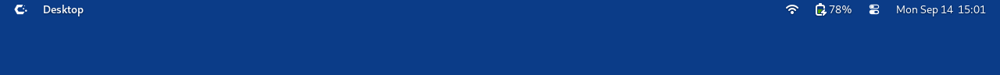
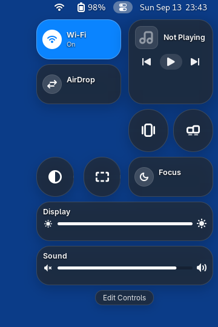
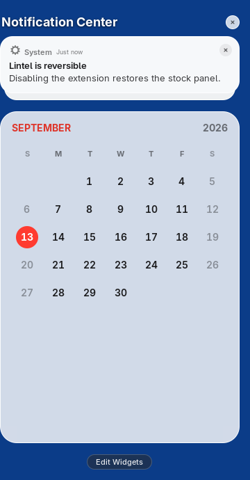
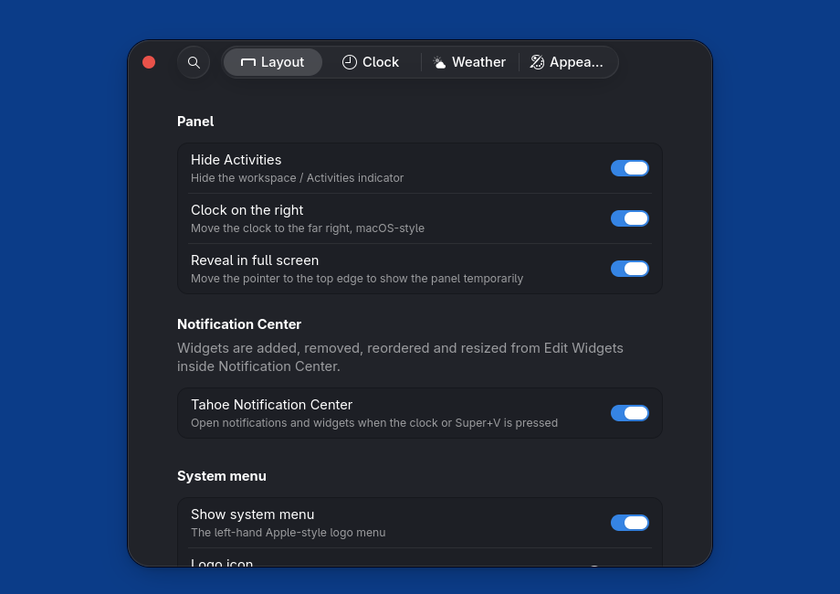

<div align="center">


# Lintel

**A macOS Tahoe–style menu bar for GNOME Shell — built on top of the native panel, not instead of it.**

[](metadata.json)
[](LICENSE)


**English** · [Русский](README.ru.md)

</div>

---

Lintel turns the GNOME top bar into a menu bar modeled on macOS Tahoe. You get a
system menu, the focused app's name, separate Wi-Fi and battery menus, a Control
Center, and a floating Notification Center with widgets.

It doesn't replace GNOME's `Panel`: it rearranges the panel's contents and puts
everything back when you turn it off. Notifications, accessibility, work-area
geometry and other extensions' status icons all keep working. **Disabling Lintel
restores the stock top bar right away, with no need to log out.**

## Screenshots



| Control Center | Notification Center |
|:---:|:---:|
|  |  |

<p align="center">
  
  <br>
  <sub>Live preferences for layout, clock, weather and appearance</sub>
</p>

## Features

- **System menu.** A logo at the far left (you can change it) opens a compact
  menu with About, Settings, App Center, Recent Items, Force Quit, Sleep,
  Restart, Shut Down, Lock and Log Out. All of these use GNOME's own system
  actions and confirmation dialogs.
- **Active application name.** The focused app's name appears in bold next to
  the logo. It updates smoothly as you Alt+Tab.
- **macOS-style clock.** The date follows your locale's order, and the digits
  are fixed-width so the bar doesn't shift every minute. Options match macOS:
  show the date, day of the week, AM/PM and seconds.
- **Notification Center.** Click the clock or press <kbd>Super</kbd>+<kbd>V</kbd>
  to open a floating column of cards on the right. It uses GNOME's native
  notification list, so grouping, actions, dismiss and Clear all work as usual.
  Widgets: Calendar, Up Next, Weather, Screen Time, System (CPU/memory/network),
  Battery, Now Playing and Clock. In Edit Widgets mode you can add, remove,
  reorder and resize them.
- **Control Center.** A popup in the Tahoe layout with:
  - Wi-Fi, Bluetooth, Focus (Do Not Disturb) and Dark Mode toggles
  - an AirDrop tile that opens your nearby file-sharing app (see
    [Requirements](#requirements))
  - Now Playing (MPRIS)
  - Display and Sound sliders
  - utility buttons

  **Edit Controls** rearranges the popup in place: remove controls, add them
  back, reorder them, and switch each one between a circle and a wide capsule.
  Airplane Mode, Power Mode, Night Light and a Microphone slider are available
  there too, off by default.
  Controls your hardware lacks (Bluetooth, Wi-Fi on a wired PC, brightness on a
  desktop monitor) are hidden and the rest move up to fill the gap. Toggles from
  other extensions' Quick Settings also show up here. Caffeine gets a dedicated
  adapter.
- **Separate Wi-Fi and battery menus.** The Wi-Fi menu shows live networks, the
  active connection and a radio switch. The battery menu shows charge, time
  remaining, power source and power profiles.
- **Notification banners on the right**, beneath the clock rather than centered.
- **Appearance.** The bar can be transparent, translucent, solid or follow
  GNOME. With automatic text color, it reads the wallpaper under the bar and
  switches between light and dark text. Height, padding, spacing, font, corner
  radius and hover/press effects are adjustable.
- **Fullscreen reveal.** In a fullscreen app, push the pointer up against the
  top edge and the bar slides in over the app. Just touching the edge does not
  reveal it, so tabs and toolbars at the very top stay usable.
- **Live preferences.** Every setting in the libadwaita preferences window
  applies instantly, with no need to re-enable the extension.
- **Translations:** English and Russian.

## Requirements

- **GNOME Shell 50** is the primary target; GNOME Shell 51 is supported as well.
  Lintel is developed and tested on Wayland.
- Optional, for specific widgets:
  - *Weather:* Location Services (GeoClue) for automatic location. You can
    enter a city instead. Forecasts come from keyless services (Open-Meteo or
    wttr.in), so no API key is needed.
  - *Up Next / Calendar events:* calendars in GNOME Calendar or Evolution Data
    Server.
  - *Screen Time:* GNOME Settings → Wellbeing with screen-time recording on.
  - *App Center item:* any app registered for `appstream://` links, such as
    GNOME Software.
  - *AirDrop tile:* GNOME has no AirDrop, so the tile launches the first
    installed nearby-sharing app, in this order:
    [LocalSend](https://localsend.org) (native package or Flatpak),
    [GSConnect](https://github.com/GSConnect/gnome-shell-extension-gsconnect),
    [KDE Connect](https://kdeconnect.kde.org), then GNOME's Bluetooth file
    transfer (`bluetooth-sendto`, only when a Bluetooth adapter is present). The
    tile's second line names the app it will open. If none is installed, it
    opens Settings → Sharing. LocalSend is the closest match: it works with
    phones and computers on the same network, iPhone and Android included.

## Installation

### From a release

1. Download `lintel@topbar.shell-extension.zip` from the
   [Releases](../../releases) page.
2. Install it:

   ```bash
   gnome-extensions install --force lintel@topbar.shell-extension.zip
   ```

3. Log out and back in. On Wayland, GNOME Shell only picks up new extensions
   at login.
4. Enable it:

   ```bash
   gnome-extensions enable lintel@topbar
   ```

### From source

```bash
git clone https://github.com/eliotBenitez/lintel.git
cd lintel
./install.sh          # compiles schema + translations, symlinks into ~/.local/share/gnome-shell/extensions
```

Log out and back in, then run `gnome-extensions enable lintel@topbar`.

`install.sh` needs `glib-compile-schemas` and `msgfmt` (gettext).

## Usage

| Action | How |
|---|---|
| Open the Notification Center | Click the clock, or press <kbd>Super</kbd>+<kbd>V</kbd> |
| Edit Notification Center widgets | Open it and choose **Edit Widgets** |
| Open the Control Center | Click the Control Center icon just left of the clock |
| Open preferences | `gnome-extensions prefs lintel@topbar`, or use the Extensions app |
| Show the bar in fullscreen | Push the pointer up against the top edge of the screen |

The preferences window has four pages: **Layout**, **Clock**, **Weather** and
**Appearance**. Every setting is also a GSettings key, so you can script it:

```bash
gsettings set org.gnome.shell.extensions.lintel appearance translucent
gsettings list-recursively org.gnome.shell.extensions.lintel
```

### Native Quick Settings mode

If you'd rather keep GNOME's own Quick Settings menu, turn off the custom
Control Center:

```bash
gsettings set org.gnome.shell.extensions.lintel control-center-mode native
```

## Compatibility with other extensions

Lintel keeps GNOME's `statusArea`, `menuManager` and Quick Settings intact, so
other extensions' indicators stay put. Their Quick Settings toggles appear as
buttons in the Control Center. Tiles the Control Center can't show, such as
sliders and custom widgets, stay in GNOME's native Quick Settings, which is
still available whenever they're present.

## Uninstall

```bash
gnome-extensions disable lintel@topbar
gnome-extensions uninstall lintel@topbar
```

Disabling alone restores the stock top bar. To reset every Lintel setting:

```bash
dconf reset -f /org/gnome/shell/extensions/lintel/
```

## Development

```bash
./install.sh                                   # symlink the checkout into your extensions dir
dbus-run-session -- gnome-shell --nested --wayland   # isolated nested test shell
journalctl --user -f -o cat /usr/bin/gnome-shell     # watch for GJS errors
tools/check-undefined-calls.py                 # static check for calls to deleted/undeclared helpers
tools/update-translations.sh                   # regenerate the .pot and merge .po files
tools/package.sh                               # build dist/lintel@topbar.shell-extension.zip
tools/capture-screenshots.sh                   # rebuild the reproducible GNOME Shell gallery
```

GNOME Shell caches extension modules, so after editing `.js` files you'll
usually need to log in again (or use a nested shell) to see the changes.

Where to look next:

- [`docs/ARCHITECTURE.md`](docs/ARCHITECTURE.md): design, module layout and the
  "never replace `Main.panel`" rule.
- [`docs/IMPLEMENTATION.md`](docs/IMPLEMENTATION.md): per-subsystem status and
  the full manual test checklist.
- [`docs/TESTING.md`](docs/TESTING.md): live-session test protocol, including
  the 20-cycle enable/disable stress test.
- [`docs/DECISIONS.md`](docs/DECISIONS.md) and
  [`docs/PROJECT_MEMORY.md`](docs/PROJECT_MEMORY.md): architecture decisions and
  GNOME Shell quirks we've found.
- [`AGENTS.md`](AGENTS.md): coding style and contribution guidelines.

### Contributing

Issues and pull requests are welcome. In a pull request, please describe:

- the user-visible change
- which GNOME versions you tested on
- your manual test results, including whether disabling still restores the
  stock panel

For visual changes, add screenshots.

### Translations

Translations live in [`po/`](po). To add a language, copy `po/lintel@topbar.pot`
to `po/<lang>.po`, translate it, and run `tools/update-translations.sh`.

## License

Lintel is free software, released under the
[GNU General Public License v2.0 or later](LICENSE).

---

<sub>Lintel is an independent project and is not affiliated with or endorsed by
Apple Inc. macOS and macOS Tahoe are trademarks of Apple Inc., used here only to
describe the design reference.</sub>
