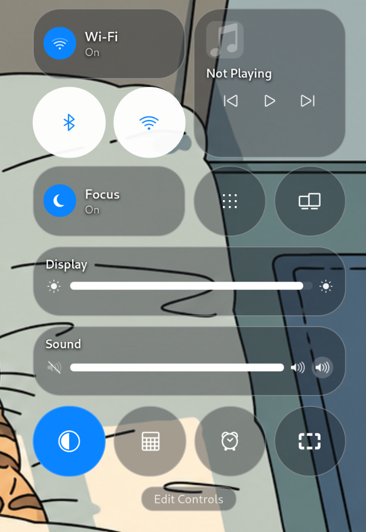

# Control Center: Tahoe fidelity audit

Date: 2026-09-08

## Scope

Surface: the default open state of the extension's custom Control Center.

User goal: make the GNOME implementation read as the macOS Tahoe 26 Control
Center at first glance, while preserving the existing GNOME service backends.

Evidence:

- [Current implementation](01-current-control-center.png), supplied in the
  current audit run (619 × 901 px).
- [Apple's Tahoe Control Center image](https://www.apple.com/newsroom/images/2025/06/macos-tahoe-26-makes-the-mac-more-capable-productive-and-intelligent-than-ever/article/Apple-WWDC25-macOS-Tahoe-26-Control-Center-250609_big.jpg.large.jpg).
- [Apple newsroom: macOS Tahoe 26](https://www.apple.com/newsroom/2025/06/macos-tahoe-26-makes-the-mac-more-capable-productive-and-intelligent-than-ever/).
- [Apple Support: Use Control Center on Mac](https://support.apple.com/guide/mac-help/quickly-change-settings-mchl50f94f8f/mac).
- [Apple HIG: Materials](https://developer.apple.com/design/human-interface-guidelines/materials).

## Step 1 — Default Control Center open

Health: **needs a substantial visual pass; the content map is recognizable but
the material, control states, typography and media hierarchy do not yet read as
Tahoe.**

### What is already structurally useful

- The default module order is close to Apple's promotional default: connectivity
  and Focus on the left, Now Playing and utilities on the right, then Display,
  Sound, four compact actions and Edit Controls.
- The popup has no traditional GNOME menu plate or callout arrow. That is the
  right foundation for a floating Liquid Glass composition.
- Controls are already wired to GNOME services, and interactive actors have
  accessible names.

### Highest-impact visual gaps

1. **The material is too dark and too uniform.** Every module uses essentially
   the same `rgba(20, 24, 32, 0.38)` plate. The result reads as grey glassmorphism
   cards, not a thin functional layer that keeps the wallpaper visually alive.
   The wallpaper lines remain sharp, so the tint feels muddy while the blur feels
   weak.
2. **Borders dominate the material.** The continuous 30% white stroke outlines
   every object. Tahoe relies more on blur, subtle edge light, soft elevation and
   changing background colour; the current screen looks wireframed.
3. **State styling is contradictory.** Bluetooth and AirDrop are white in both
   checked and unchecked states, while Wi-Fi and Focus use blue. A glance cannot
   tell which radio controls are active. Checked controls need the same blue-fill
   grammar; inactive controls need neutral glass.
4. **Typography is visually heavy.** Hard-coded Cantarell plus an 82%-black text
   shadow creates a halo around labels. Tahoe's hierarchy is cleaner: compact
   system type, semibold primary labels, quieter secondary text and only a subtle
   contrast aid.
5. **Now Playing has the wrong information hierarchy.** The empty-state note is
   oversized and detached from the title, while the three transport controls
   float below it. Artwork, track/artist and transport controls need to form one
   compact media composition; the empty state should not look like a broken album
   cover.
6. **Several icons are semantically approximate.** AirDrop reuses a Wi-Fi glyph
   and Stage Manager becomes a nine-dot app grid. These are immediately visible
   mismatches even when geometry is close.
7. **The Sound module is cluttered.** It shows a leading mute glyph, a loudness
   glyph, and another loudspeaker inside a circle. The three adjacent speaker
   symbols compete with the slider instead of expressing minimum, current state,
   and output selection clearly.
8. **Shape rhythm is inflated.** Capsules, media card and circular actions all
   use almost the same extreme rounding and visual weight. Tahoe keeps a common
   curvature language but distinguishes long controls, media surfaces and compact
   actions through size and corner treatment.
9. **Focus and keyboard focus are not distinct enough.** The same small tint
   change is used for hover and focus. A keyboard user needs a visible focus
   treatment that remains legible over changing wallpaper.

### Interaction gaps relative to Tahoe

- Apple separates direct state changes from opening more options; Wi-Fi, Focus
  and Screen Mirroring can lead to detail views. The current large Wi-Fi/Focus
  capsules only toggle a setting.
- Tahoe 26 lets people add, remove, rearrange and resize controls, including
  controls from apps, and supports pages. The current `Edit Controls` action only
  opens extension preferences and the layout is static.
- The current AirDrop action opens GNOME Sharing settings rather than expressing
  a real availability/state model. It should be presented as a navigation action,
  not as a misleading toggle.

## Recommended implementation order

1. Replace the material tokens: lighter tint, stronger background diffusion,
   lower border contrast, softer shadow and restrained highlight.
2. Normalize geometry and typography, then rebuild Now Playing and both sliders.
3. Introduce explicit `active`, `inactive`, `unavailable`, `hover`, `pressed` and
   keyboard-focus states shared by every control type.
4. Replace misleading icons with the closest installed symbolic icons and remove
   redundant Sound glyphs.
5. Split toggle actions from detail/navigation actions. Treat full Tahoe-style
   editing and pages as a later functional phase, not as part of the visual pass.

## Implemented in 0.14.0

The first fidelity pass now covers recommendations 1–4 and the non-deceptive
part of recommendation 5:

- Liquid Glass modules use a 46 px background blur, restrained 14% edge light,
  softer elevation and a neutral 44% contrast tint instead of the previous
  heavy white outline.
- Wi-Fi, Focus, Bluetooth and Dark Mode share one blue checked-state grammar;
  AirDrop remains visibly neutral because it navigates to Sharing rather than
  exposing a real AirDrop toggle backend.
- The primary columns now share one baseline. Compact controls are equal 69 px
  circles, and the media surface uses a separate 24 px corner treatment.
- Now Playing groups artwork, title/artist and evenly distributed transport
  controls. Its empty state no longer leaves an oversized note detached from
  the title.
- Display and Sound use the correct Shell `BarLevel` theme properties for a
  white Tahoe-style fill. Sound has one maximum-volume glyph instead of two
  competing output symbols.
- AirDrop uses the installed transfer symbol and Stage Manager uses GNOME's
  installed multitasking symbol; no custom approximation assets were drawn.
- Hover, pressed, checked, unavailable and keyboard-focus treatments are now
  visually distinct.

Rendered evidence:

- [GNOME 50 full-screen capture](02-implementation-gnome50.png)
- [Control Center crop](03-implementation-popup.png)
- [Before/after normalized comparison](04-before-after.png)

The full Tahoe editor/pages model is still intentionally deferred. `Edit
Controls` continues to open extension preferences.

## Accessibility and evidence limits

- The screenshot shows contrast risk over mixed wallpaper, but it cannot prove
  contrast ratios because the material changes with background and blur.
- Keyboard order, focus visibility, slider announcements, checked-state
  announcements and motion still require a live GNOME session with keyboard and
  AT-SPI/Orca testing.
- Only the default open state was supplied. Detail panels, disabled services,
  active media, dark appearance, reduced transparency and Edit Controls were not
  visually audited in this run.
